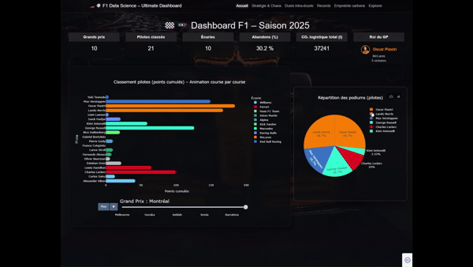
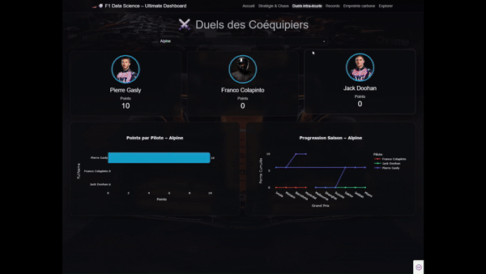
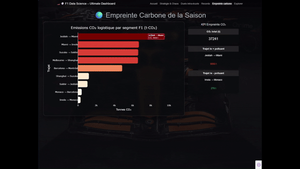

# 🏎️ F1 Data Science Dashboard 2025

> **Auteur** : Czmil DOSSOU-YOVO  
> **Projet Data Science, Machine Learning, Visualisation avancée**

*Projet académique réalisé dans le cadre du cours "Data Science"*  
***Intervenant** : Antoine GREA*

*ESTIAM - E5 BDAI - 2024-2025*

---

## 📑 Sommaire
1. [Présentation](#présentation)
2. [Pipeline & Organisation](#pipeline--organisation)
3. [Dataset & Sources](#dataset--sources)
4. [Installation & Lancement](#installation--lancement)
5. [Fonctionnalités du Dashboard](#fonctionnalités-du-dashboard)
6. [Notebooks & Analyses](#notebooks--analyses)
7. [Insights Clés](#insights-clés)
8. [Structure du Projet](#structure-du-projet)
9. [Stack Technique & Références](#stack-technique--références)
10. [Aperçu GIFs](#aperçu-gifs)
11. [Limites & Perspectives](#limites--perspectives)
12. [Auteur / Contact](#auteur--contact)

---

## Présentation
Ce projet propose **une analyse complète, interactive et créative de la saison 2025 de Formule 1** à travers un pipeline de data science moderne :

- **Dashboard captivant** mêlant statistiques, stratégie, records, machine learning et impact carbone.
- **Story-telling visuel** pour passionnés **et** néophytes.
- **Exploration avancée** : performance, chaos, environnement, ML, playground interactif.

---

## Pipeline & Organisation

- **Acquisition** : Lancer obligatoirement `notebooks/notebook_acquisition.ipynb` pour récupérer et stocker les données dans `data/`.
- **Exploration & Visualisation** *(optionnel)* : `notebooks/notebook_eda_viz.ipynb` pour explorer les analyses descriptives et visualisations avancées.
- **Machine Learning** *(optionnel)* : `notebooks/notebook_ml_evaluation.ipynb` pour tester les modèles prédictifs.
- **Dashboard** : Lancer `dashboard.py` pour accéder à l'application interactive finale (utilise les données du dossier `data/`).
- **Optimisation** : Le dashboard intègre un **système de cache intelligent** pour les graphiques lourds (voir section technique), garantissant une navigation ultra-fluide après le premier chargement.

---

## Dataset & Sources

| Fichier Parquet | Description | Source |
|-----------------|-------------|--------|
| results_2025.parquet | Résultats de course (positions, points, statuts, pilotes, équipes) | FastF1 API |
| qualifying_2025.parquet | Résultats qualifications | FastF1 API |
| pitstops_2025.parquet | Arrêts aux stands enrichis | FastF1 API + enrichissement |
| weather_2025.parquet | Données météo par GP | FastF1 API |
| driver_standings_2025.parquet | Classement pilotes | FastF1 API |
| team_standings_2025.parquet | Classement équipes | FastF1 API |
| flightlegs_2025.parquet | Segments logistiques F1 (trajets, CO₂) | OpenFlights + calculs |

**Enrichissements** :
- Palette pneus officielle, images pilotes, calcul CO₂ logistique (méthodologie officielle FIA/DHL)
- Normalisation des noms pilotes, audit qualité, gestion des valeurs manquantes

**Actualisation** :
- Les données sont récupérées et mises à jour à chaque exécution du notebook d'acquisition (en fonction de la disponibilité officielle FIA)

---

## Installation & Lancement

### 1. Cloner le repo
```bash
git clone https://github.com/CzmilDos/F1-Data-Science-Project-.git
cd f1-2025-ds-dashboard
```

### 2. Créer & activer un environnement virtuel
```bash
# Sur Windows
python -m venv venv
venv\Scripts\activate

# Sur macOS/Linux
python3 -m venv venv
source venv/bin/activate
```

### 3. Installer les dépendances
```bash
pip install -r requirements.txt
```

### 4. Exécuter le pipeline
- **1️⃣ Acquisition** : Lancer `notebooks/notebook_acquisition.ipynb` (Jupyter) pour générer/mettre à jour les fichiers dans `data/`
- **2️⃣ EDA & ML** : Explorer `notebooks/notebook_eda_viz.ipynb` et `notebooks/notebook_ml_evaluation.ipynb`
- **3️⃣ Dashboard** :
```bash
python dashboard.py
```
- Accéder à l'URL locale affichée (généralement http://127.0.0.1:8050)

---

## Fonctionnalités du Dashboard

Le dashboard (Dash/Plotly) propose **6 pages interactives** :

1. **Accueil** :
   - KPIs dynamiques (GP, pilotes, écuries, abandons, CO₂, etc.)
   - Animation bar race (classement pilotes)
   - Pie chart podiums
2. **Stratégie & Chaos** :
   - Heatmap interactive (progression grille/arrivée)
   - Bar chart abandons par course
   - Analyse stratégie pneus par GP (dropdown interactif)
   - **Optimisation** : Les graphiques FastF1 sont mis en cache pour accélérer l'affichage.
3. **Duels intra-écurie** :
   - Comparatif coéquipiers (points, face-à-face, progression)
   - Cartes pilotes, bump chart, bar chart
4. **Records / Storytelling** :
   - Top 10 remontées, streaks de points, abandons, podiums
   - Visualisation des records marquants
5. **Empreinte carbone** :
   - Analyse logistique F1 (trajets, émissions CO₂, KPI, segments)
   - **Optimisation** : Les graphiques sont pré-calculés et lus instantanément après le premier accès.
6. **Explorer (Playground)** :
   - Corrélations, scatter, outliers, PCA 2D, playground interactif
   - **Navigation fluide** grâce au cache graphique.

**UX/UI** :
- Thème dark, glassmorphism, animations, responsive, navigation fluide
- CSS custom (assets/style.css)
- **Système de cache graphique** pour une expérience utilisateur optimale

---

## Notebooks & Analyses

### 1️⃣ notebook_acquisition.ipynb
- **Objectif** : Automatiser l'acquisition, la préparation et l'audit qualité des données F1 2025 (API FastF1, OpenFlights)
- **Étapes** :
  - Téléchargement multi-sources, mapping circuits/aéroports, calcul CO₂ logistique
  - Nettoyage, normalisation, gestion des valeurs manquantes
  - Export des datasets au format Parquet dans `data/`

### 2️⃣ notebook_eda_viz.ipynb
- **Objectif** : Analyse exploratoire, visualisations interactives, statistiques descriptives
- **Analyses** :
  - Statistiques de base (résultats, qualifs, pitstops, standings)
  - Corrélations, points par écurie, analyse pneus, abandons, CO₂
  - Visualisations avancées (heatmap, bump chart, bar chart, etc.)

### 3️⃣ notebook_ml_evaluation.ipynb
- **Objectif** : Modélisation prédictive (Machine Learning)
- **Modèles** :
  - Classification : Prédiction de podium (top 3) selon qualifs, équipe, météo, stratégie
  - Régression : Prédiction de la durée d'un pitstop (features enrichies)
  - Évaluation : Scores, courbes ROC, feature importance, visualisation des résultats

---

## Insights Clés

- **Podiums & records** : Identification des pilotes les plus performants, des plus grandes remontées, des streaks de points
- **Stratégie pneus** : Analyse des choix de gommes, impact sur la course
- **Abandons/chaos** : Courses les plus chaotiques, taux d'abandon, analyse des causes
- **Empreinte carbone** : Calcul précis des émissions logistiques, identification des segments les plus polluants
- **Corrélations** : Départ vs arrivée, points vs qualifs, outliers, clusters PCA
- **Machine Learning** : Prédiction de podiums et de pitstops avec des performances significatives malgré l'aléa F1

---

## Structure du Projet

```
├── assets/
│   └── style.css           # CSS custom (glassmorphism, dark, responsive)
├── data/                   # Données Parquet générées par le pipeline
│   ├── results_2025.parquet
│   ├── qualifying_2025.parquet
│   ├── pitstops_2025.parquet
│   ├── weather_2025.parquet
│   ├── driver_standings_2025.parquet
│   ├── team_standings_2025.parquet
│   └── flightlegs_2025.parquet
├── notebooks/
│   ├── notebook_acquisition.ipynb    # Acquisition & préparation
│   ├── notebook_eda_viz.ipynb        # EDA & visualisation
│   └── notebook_ml_evaluation.ipynb  # Machine Learning
├── dashboard.py             # Application Dash/Plotly multi-pages
├── requirements.txt         # Dépendances Python
└── Readme.md                # Documentation
```

---

## Stack Technique & Références

| Catégorie      | Outils                                                                 |
| -------------- | ---------------------------------------------------------------------- |
| **Langage**    | Python 3.10                                                            |
| **Viz / App**  | Dash, Plotly Express & GO, Dash Bootstrap Components                   |
| **Data**       | Pandas, Numpy                                                          |
| **ML**         | Scikit-learn                                                           |
| **Sources**    | FastF1 / Jolpica, OpenFlights, Palette pneus F1, BEIS CO₂ 2024         |
| **LLM Assist** | OpenAI GPT-4.1 (assistance à la génération de code et documentation)    |
| **Notebook**   | Jupyter                                                                |
| **CSS**        | Glassmorphism, dark mode, animations (custom CSS)                      |
| **Optimisation** | **Système de cache graphique JSON UTF-8** (pré-calcul & lecture rapide)

### ⚡️ Optimisation & Cache Graphique

Pour garantir une **navigation rapide et fluide**, le dashboard utilise un système de cache pour les graphiques lourds :
- **Premier accès** : le graphique est généré et sauvegardé au format JSON UTF-8 dans le dossier `data/`.
- **Accès suivants** : le graphique est chargé instantanément depuis le fichier, sans recalcul ni appel API FastF1.
- **Résultat** : expérience utilisateur optimale, même avec des visualisations complexes ou des données volumineuses.
- **Technique** :
  - Utilisation de `plotly.to_json()`/`from_json()` avec gestion manuelle de l'encodage UTF-8 (compatible Windows/Linux/Mac).
  - Cache FastF1 activé pour accélérer les accès aux données brutes.
  - Ce système est appliqué à toutes les pages du dashboard (Accueil, Stratégie, Records, Empreinte carbone, Explorer).

**Fichier requirements.txt** :
```
dash>=2.0.0
pandas>=1.3.0
numpy>=1.21.0
plotly>=5.0.0
dash-bootstrap-components>=1.0.0
scikit-learn>=1.0.0
jupyter
fastf1
```

**Références** :
- [FastF1 API](https://theoehrly.github.io/Fast-F1/)
- [Plotly Dash](https://dash.plotly.com/)
- [OpenFlights](https://raw.githubusercontent.com/jpatokal/openflights/master/data/airports.dat)
- [DHL/FIA CO₂ Methodology](https://www.gov.uk/government/publications/greenhouse-gas-reporting-conversion-factors-2024)
- [OpenAI GPT-4.1](https://openai.com/index/gpt-4-1/)

---

## Aperçu GIFs

<p align="center">
  
</p>

<p align="center">
  
  
</p>
<p align="center">
  
  
</p>


## Limites & Perspectives

- **Dépendance à la publication FIA** : Données parfois indisponibles immédiatement après un GP
- **Données publiques** : Certaines variables avancées (télémétrie, stratégies internes) non accessibles
- **Machine Learning** : Modèles perfectibles, performances limitées par la taille/qualité des données publiques
- **Axes d'amélioration** :
  - Ajout de prédictions temps réel (live dashboard)
  - Intégration de données télémétriques avancées
  - Analyse environnementale plus poussée (scope 3, logistique maritime)
  - Collaboration avec la communauté F1/data science

---

## Auteur / Contact

- **Czmil DOSSOU-YOVO**
- [LinkedIn](https://www.linkedin.com/in/czmildos/)  
---

*Merci de citer ce projet si vous le réutilisez ou l'adaptez !*
>*“La data c'est bien, la data à 300 km/h c'est mieux.”* 😉